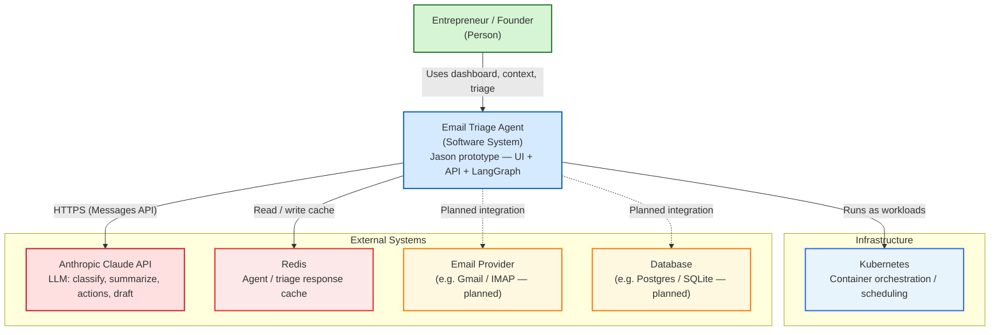
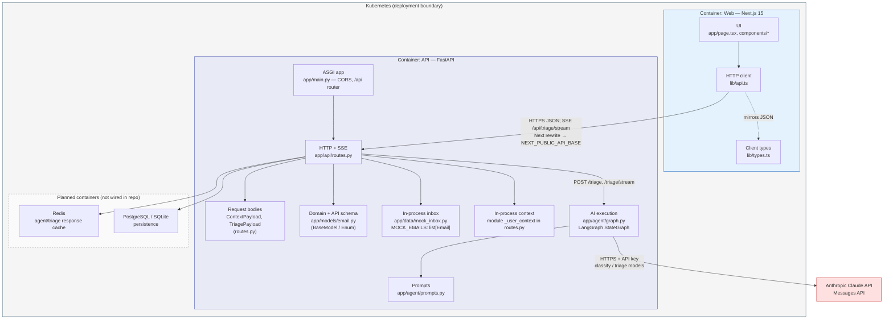

# Consolidation Plan
Use Jason's prototype as a starting point, as a single page for the bulk of functionality seems more appropriate for this project. Include a similar tabbing ability from Ethan's prototype. Where Ethan has top buttons going to different pages, keep everything on one page and then add sidebar buttons. Also add the collapsibility from Ethan's prototype.

# C4 Context Model

# C4 Container Model
