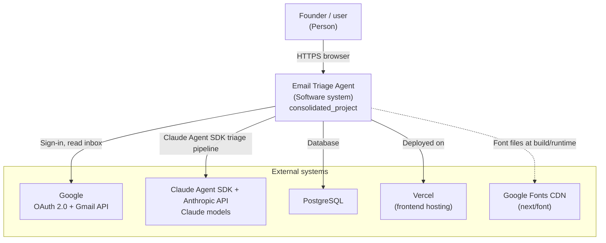
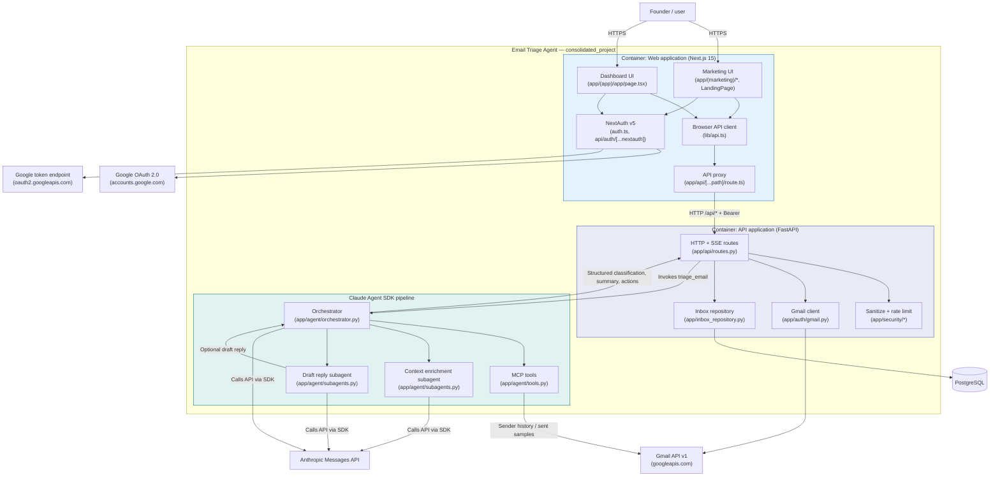

# Part 1: Product Vision (Revisited)
FOR **entrepreneurs**

WHO **lead a small team, thus needing to balance time, prioritize high-value sales leads, and quickly respond to client communications received via email**

THE **Email Triage Agent** IS A **SaaS platform**

THAT **automatically organizes, prioritizes, and surfaces actionable insights from your inbox**

UNLIKE **general-purpose tools like Google Gemini in Gmail**

OUR PRODUCT **adapts based on your specific workflows, business context, and decision-making patterns to deliver a personalized email management system**

POWERED BY **the Claude Agent SDK, specialized subagents, intent classification, priority scoring, semantic summarization, automated draft generation, and Google / Gmail API integration**

*Our product vision shifted to a sales-focused context to help entrepreneurs prioritize sales leads and client communications. Additionally, the technology stack was updated to reflect the transition from an in-process LangGraph pipeline to a Claude Agent SDK orchestrator with specialized subagents.*
________________

# Part 2: W4 Intended Architecture
Link to the W4 C4 context and container diagrams

[LINK](../architecture/architecture.md)

For the W4 intended architecture, the team planned to build a consolidated single-page Email Triage Agent application deployed as containerized workloads orchestrated on Kubernetes. The setup featured a Next.js 15 frontend and a FastAPI backend with a monolithic LangGraph pipeline running in-process to handle email classification, summarization, action extraction, and draft replies using the Anthropic Claude API. Additionally, the plan included deploying a PostgreSQL/SQLite database for email and context persistence and a Redis caching layer for agent and triage responses within the Kubernetes cluster.

________________
## Part 3: Current-State Architecture

### C4 Context Model

### C4 Container Model

________________
# Part 4: Decisions that Shifted

### Transitioning from LangGraph to Claude Agent SDK
- **Context**: The team needed more flexible agent behavior than the original in-process LangGraph StateGraph provided. The triage flow now needs an orchestrator that can coordinate structured classification, summarization, action extraction, optional drafting, Gmail-aware enrichment, and profile-cache tools without forcing every step into one rigid graph.
- **Decision**: We transitioned the LLM pipeline from an in-process LangGraph graph to a Claude Agent SDK orchestrator (`app/agent/orchestrator.py`) with specialized subagents for context enrichment and drafting (`app/agent/subagents.py`) plus MCP tools for Gmail history and profile caching (`app/agent/tools.py`).
- **Consequences**: This reduces custom graph code and gives the agent more flexibility, but it introduces new runtime dependencies on the Claude Agent SDK, subprocess-based Claude CLI execution, stricter environment setup, and less transparent failure modes unless SDK errors are logged carefully.
- **Classification**: **Deliberate and prudent**. The shift was actively chosen because Claude Agent SDK better matches the product's need for tool-using, context-aware email triage while keeping the backend FastAPI routes and frontend streaming API stable.
________________
# Part 5: Tech Debt Heading into Code Freeze

### 1. Silent Database Fallback to In-Memory Mock Repository
- **Classification**: **Deliberate and prudent**. This fallback was explicitly added to allow seamless local development and demoing without requiring a live PostgreSQL instance, but it runs the risk of silently masking real connection failures in production.
- **Plan**: We will live with this through demo night to ensure maximum demo stability, but will implement explicit database health checks and connection error boundaries immediately afterward.

### 2. Synchronous Gmail API Operations in Worker Threads
- **Classification**: **Deliberate and prudent**. Using the official synchronous `google-api-python-client` library saved significant development time, but wrapping synchronous network calls in `asyncio.to_thread` consumes thread pool resources and limits maximum request concurrency.
- **Plan**: We will live with this through demo night since the concurrency during live demos is extremely low, but will transition to a fully asynchronous HTTP client (e.g. calling Gmail endpoints via `httpx`) post-demo.

### 3. Google OAuth 2.0 and Gmail API Integration
- **Classification**: **Inadvertent and reckless**. We built the frontend too early and didn't have a clear plan for the backend. We should have built the backend first and then the frontend.
- **Plan**: We will live with this through demo night since the concurrency during live demos is extremely low, but will transition to a fully asynchronous HTTP client (e.g. calling Gmail endpoints via `httpx`) post-demo.

________________
# Part 6: What We Would Do Differently

If we had another sprint, we would harden the Claude Agent SDK integration rather than replacing the architecture again. The biggest improvements would be clearer SDK error logging, lower-risk concurrency defaults for local demos, stronger structured-output validation, and more explicit tests around when the drafter subagent should or should not generate a reply.