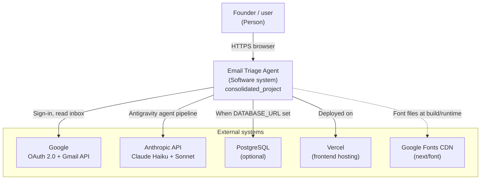
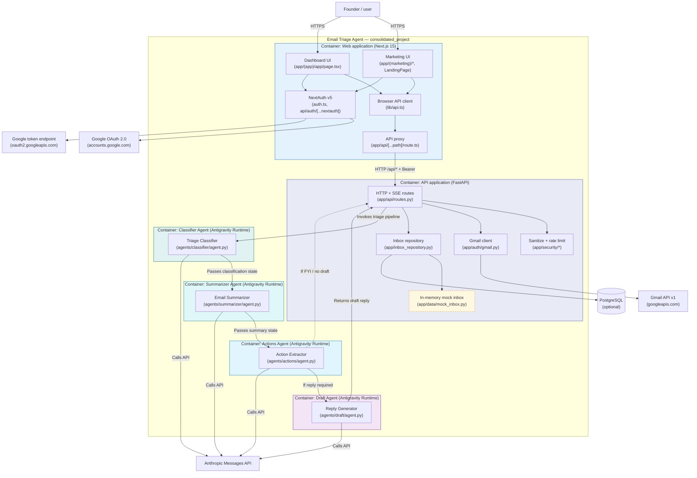

Part 1: Product vision revisited from W2 (updated if anything shifted); current C4 context and container diagrams that reflect the state of main; 1 to 3 decisions that shifted, each with context, decision, consequences, and Fowler-quadrant classification; tech debt list with per-item classification and a plan; one sentence on what the team would do differently
____________

Write a note at docs/architecture-retrospective.md that compares your W4 architecture to what you have built, classifies the tech debt you are carrying into code freeze, and explains the decisions that shifted along the way.

This is a modified ADR practice. ADRs are normally written at the time of the decision and kept as a living record. Most of your architectural decisions got made fast and undocumented during the prototype phase. The team is reverse-engineering a few of them now as a learning exercise.

Required structure:

Product vision (revisited). Paste the W2 product vision statement. If anything has shifted (audience, problem, key differentiator, POWERED BY line), update the statement and add one or two sentences on what changed and why. If nothing has shifted, say so in one sentence.
W4 intended architecture. Link to the C4 context and container diagrams the team submitted in W4. One-paragraph summary of what the team planned to build.
Current-state architecture. Current C4 context diagram and current C4 container diagram, both reflecting what is on main today (not the W4 plan, not where you hope to be by code freeze). Use any tool the team likes: Mermaid, draw.io, Excalidraw, Lucidchart, a Cursor-generated draft you correct, hand-drawn on paper or a tablet. Embed in the note as PNG, SVG, or Mermaid, or link from a docs/architecture/ subfolder.
Decisions that shifted. Pick 1 to 3 architectural decisions that changed between W4 and now. For each, write a short block in this shape:
Context: what forced the call (a constraint, a surprise, a deadline, red team feedback, a teammate's Friday-night fix).
Decision: what the team chose.
Consequences: what the team accepts by choosing it (operational complexity, vendor lock-in, a new dependency, a deferred problem).
Classification: which Fowler quadrant the resulting state lives in (deliberate vs inadvertent, prudent vs reckless), with one sentence on why.
Tech debt heading into code freeze. A short list of debt items the team is carrying. Each item gets a Fowler quadrant classification and one sentence on whether the team will address it before code freeze or live with it through demo night.
One sentence on what the team would do differently with another sprint. This sentence feeds the W10 technical report.
Two to three pages of prose plus the diagrams.

________________

# Part 1: Product Vision (Revisited)
FOR **entrepreneurs**

WHO **lead a small team, thus needing to balance time, prioritize high-value sales leads, and quickly respond to client communications received via email**

THE **Email Triage Agent** IS A **SaaS platform**

THAT **automatically organizes, prioritizes, and surfaces actionable insights from your inbox**

UNLIKE **general-purpose tools like Google Gemini in Gmail**

OUR PRODUCT **adapts based on your specific workflows, business context, and decision-making patterns to deliver a personalized email management system**

POWERED BY **an Antigravity multi-agent runtime, decentralized intent classification, priority scoring, semantic summarization, automated draft generation, and Google / Gmail API integration**

*Our product vision shifted to a sales-focused context to help entrepreneurs prioritize sales leads and client communications. Additionally, the technology stack was updated to reflect the transition to an Antigravity multi-agent architecture.*
________________

# Part 2: W4 Intended Architecture
Links to the W4 C4 context and container diagrams
[CONTEXT DIAGRAM](architecture/w4-c4-context.md)
[CONTAINER DIAGRAM](architecture/w4-c4-container.md)

For the W4 intended architecture, the team planned to build a consolidated single-page Email Triage Agent application deployed as containerized workloads orchestrated on Kubernetes. The setup featured a Next.js 15 frontend and a FastAPI backend with a monolithic LangGraph pipeline running in-process to handle email classification, summarization, action extraction, and draft replies using the Anthropic Claude API. Additionally, the plan included deploying a PostgreSQL/SQLite database for email and context persistence and a Redis caching layer for agent and triage responses within the Kubernetes cluster.

________________
## Part 3: Current-State Architecture

### C4 Context Model

### C4 Container Model

________________
# Part 4: Decisions that Shifted

### Transitioning from LangGraph to Antigravity Multi-Agent Architecture
- **Context**: The team needed to support independent, highly specialized agents that could be deployed and run in parallel, which became complex to coordinate and scale cleanly within a single in-process LangGraph StateGraph.
- **Decision**: We transitioned the LLM pipeline from an in-process LangGraph graph to a decentralized multi-agent system built on Antigravity, hosting each agent (Classifier, Summarizer, Actions, and Draft) in its own separate runtime environment.
- **Consequences**: This introduces communication overhead and operational complexity between independent runtime processes, but provides distinct execution isolation and scalability for each agent component.
- **Classification**: **Deliberate and prudent**. The shift was actively chosen to build a scalable and modular multi-agent structure leveraging the strengths of the Antigravity runtime.
________________
# Part 5: Tech Debt Heading into Code Freeze

### 1. Silent Database Fallback to In-Memory Mock Repository
- **Classification**: **Deliberate and prudent**. This fallback was explicitly added to allow seamless local development and demoing without requiring a live PostgreSQL instance, but it runs the risk of silently masking real connection failures in production.
- **Plan**: We will live with this through demo night to ensure maximum demo stability, but will implement explicit database health checks and connection error boundaries immediately afterward.

### 2. Synchronous Gmail API Operations in Worker Threads
- **Classification**: **Deliberate and prudent**. Using the official synchronous `google-api-python-client` library saved significant development time, but wrapping synchronous network calls in `asyncio.to_thread` consumes thread pool resources and limits maximum request concurrency.
- **Plan**: We will live with this through demo night since the concurrency during live demos is extremely low, but will transition to a fully asynchronous HTTP client (e.g. calling Gmail endpoints via `httpx`) post-demo.

### 3. Google OAuth 2.0 and Gmail API Integration
- **Classification**: **Inadvertent and reckless**. We built the frontend too early and didn't have a clear plan for the backend. We should have built the backend first and then the frontend.
- **Plan**: We will live with this through demo night since the concurrency during live demos is extremely low, but will transition to a fully asynchronous HTTP client (e.g. calling Gmail endpoints via `httpx`) post-demo.

________________
# Part 6: What We Would Do Differently

If we had another sprint, we would not have used LangGraph and instead would have used something like a Claude agent because it has more power. Claude's advantage is that it has filesystem permissions and can run its own scripts. This would be more useful for our use case because it would allow us to have more control over the agent's behavior and more flexibility in how it handles the email data.