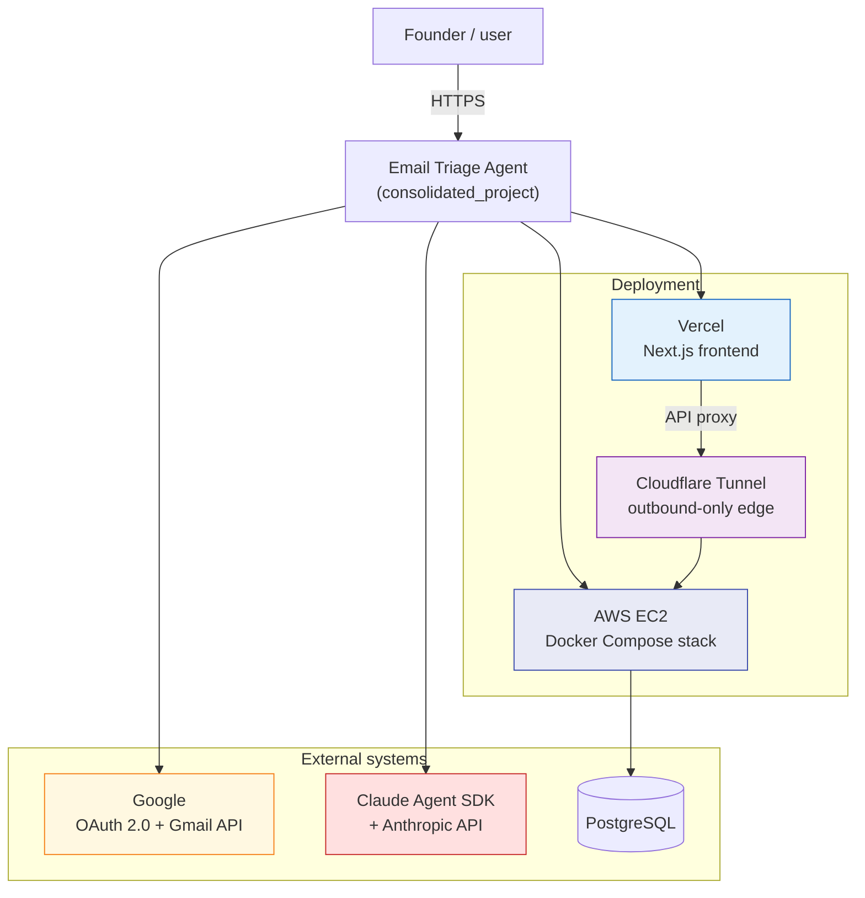
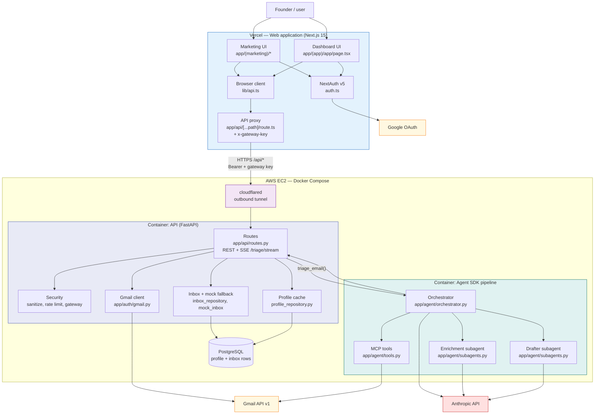

# Code Freeze Architecture — Email Triage Agent

**Tag:** `demo-night` ([a681e69](https://github.com/CSEN-SCU/csen-174-s26-team-project-email-triage-agent/commit/a681e69965080ca41f8fcee6eea1c436213eda66))

This document is the final architecture at code freeze. The logical container model matches our [W8 revised architecture](./architecture-retrospective.md) (Part 3). What differs at freeze is production deployment: the Next.js web app on Vercel, the FastAPI backend and PostgreSQL on AWS EC2 (Docker Compose), and a Cloudflare tunnel between the Vercel proxy and the private backend.

---

## C4 Context Model

---

## C4 Container Model

---

## Container summary

| Container | Host | Role | Key paths |
|---|---|---|---|
| Web (Next.js) | Vercel | Marketing, `/app` dashboard, OAuth session, API proxy | `frontend/app/`, `frontend/auth.ts`, `frontend/lib/api.ts` |
| cloudflared | AWS EC2 | Outbound tunnel; no inbound ports on host | `docker-compose.prod.yml` |
| API (FastAPI) | AWS EC2 | REST + SSE, Gmail, security, inbox, profile cache | `backend/app/api/routes.py`, `backend/app/auth/gmail.py` |
| Agent SDK | AWS EC2 (in-process) | Orchestrator, enrichment + drafter subagents, MCP tools | `backend/app/agent/orchestrator.py`, `tools.py`, `subagents.py` |
| PostgreSQL | AWS EC2 | Voice/relationship profiles; optional inbox persistence | `backend/app/profile_repository.py` |
| Google | External | OAuth sign-in, inbox read, draft/send | Scopes in `frontend/auth.ts` |
| Anthropic | External | Classification, summary, actions, drafts via SDK | `ANTHROPIC_API_KEY`, Claude Code CLI |

---

## Request path (triage)

1. Founder sets context and clicks Run triage on the dashboard (`page.tsx`).
2. Browser calls `/api/triage/stream` via `lib/api.ts`.
3. Next.js proxy (`route.ts`) attaches the Google access token and `x-gateway-key`, forwards to the Cloudflare tunnel hostname.
4. `cloudflared` on EC2 routes to `backend:8000`; FastAPI `routes.py` validates gateway key and rate limit.
5. Routes load emails from Gmail (or mock inbox), invoke `triage_email()` on the orchestrator.
6. Orchestrator runs the SDK pipeline: classify → summarize → actions → optional draft via enrichment + drafter subagents and Gmail MCP tools.
7. Each `TriageResult` streams back over SSE to the browser and renders in `BucketColumn` / `TriageCard`.

---

## Repo anchors

| Topic | Location |
|---|---|
| W8 revised architecture (logical baseline) | [architecture-retrospective.md](./architecture-retrospective.md) Part 3 |
| W4 planned architecture | [architecture.md](./architecture.md) |
| Production compose stack | [docker-compose.prod.yml](../../consolidated_project/docker-compose.prod.yml) |
| Deploy script | [infra/scripts/deploy.sh](../../infra/scripts/deploy.sh) |
| Agent SDK migration | [PR #23](https://github.com/CSEN-SCU/csen-174-s26-team-project-email-triage-agent/pull/23) |
