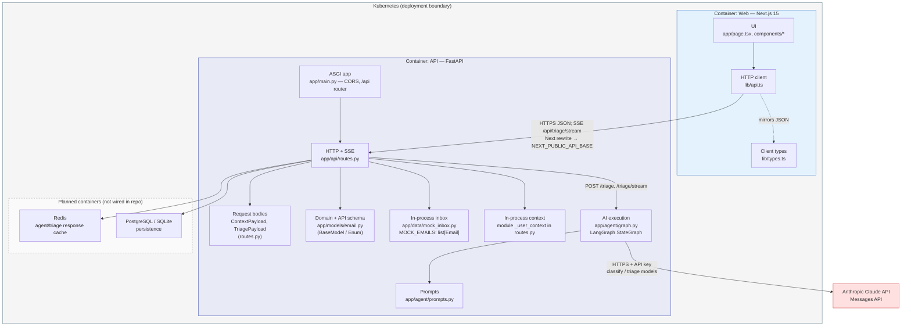

```mermaid
flowchart TB
  subgraph k8s["Kubernetes (deployment boundary)"]
    subgraph fe["Container: Web — Next.js 15"]
      ui["UI\napp/page.tsx, components/*"]
      client["HTTP client\nlib/api.ts"]
      tsSchema["Client types\nlib/types.ts"]
      ui --> client
      client -.->|"mirrors JSON"| tsSchema
    end

    subgraph be["Container: API — FastAPI"]
      app["ASGI app\napp/main.py — CORS, /api router"]
      routes["HTTP + SSE\napp/api/routes.py"]
      ioModels["Request bodies\nContextPayload, TriagePayload\n(routes.py)"]
      domain["Domain + API schema\napp/models/email.py\n(BaseModel / Enum)"]
      mock["In-process inbox\napp/data/mock_inbox.py\nMOCK_EMAILS: list[Email]"]
      ctx["In-process context\nmodule _user_context in routes.py"]
      agent["AI execution\napp/agent/graph.py\nLangGraph StateGraph"]
      prompts["Prompts\napp/agent/prompts.py"]
      app --> routes
      routes --> ioModels
      routes --> domain
      routes --> mock
      routes --> ctx
      routes -->|"POST /triage, /triage/stream"| agent
      agent --> prompts
    end

    subgraph planned["Planned containers (not wired in repo)"]
      redis["Redis\nagent/triage response cache"]
      db["PostgreSQL / SQLite\npersistence"]
    end
  end

  anthropic["Anthropic Claude API\nMessages API"]

  client -->|"HTTPS JSON; SSE /api/triage/stream\nNext rewrite → NEXT_PUBLIC_API_BASE"| routes
  agent -->|"HTTPS + API key\nclassify / triage models"| anthropic

  routes --> redis
  routes --> db

  style fe fill:#e3f2fd,stroke:#1565c0
  style be fill:#e8eaf6,stroke:#3949ab
  style planned fill:#fafafa,stroke:#9e9e9e,stroke-dasharray: 4 4
  style anthropic fill:#ffe0e0,stroke:#c62828
  style k8s fill:#f5f5f5,stroke:#607d8b
```