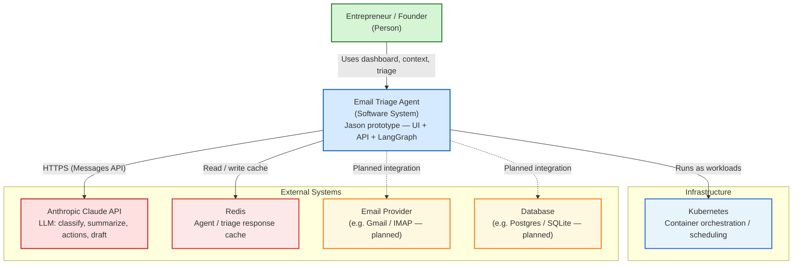

```mermaid
flowchart TB
  entrepreneur["Entrepreneur / Founder\n(Person)"]

  system["Email Triage Agent\n(Software System)\nJason prototype — UI + API + LangGraph"]

  subgraph infra["Infrastructure"]
    kubernetes["Kubernetes\nContainer orchestration / scheduling"]
  end

  subgraph external["External Systems"]
    direction TB
    anthropic["Anthropic Claude API\nLLM: classify, summarize, actions, draft"]
    redis["Redis\nAgent / triage response cache"]
    email["Email Provider\n(e.g. Gmail / IMAP — planned)"]
    database["Database\n(e.g. Postgres / SQLite — planned)"]
  end

  entrepreneur -->|"Uses dashboard, context, triage"| system
  system -->|"Runs as workloads"| kubernetes
  system -->|"HTTPS (Messages API)"| anthropic
  system -->|"Read / write cache"| redis
  system -.->|"Planned integration"| email
  system -.->|"Planned integration"| database

  %% Styling
  style entrepreneur fill:#d5f5d5,stroke:#2e7d32,stroke-width:2px
  style system fill:#d6eaff,stroke:#1565c0,stroke-width:2px
  style kubernetes fill:#e8f4fc,stroke:#326ce5,stroke-width:2px
  style anthropic fill:#ffe0e0,stroke:#c62828,stroke-width:2px
  style redis fill:#fce8e8,stroke:#dc382d,stroke-width:2px
  style email fill:#fff8e1,stroke:#f57f17,stroke-width:2px
  style database fill:#fff8e1,stroke:#f57f17,stroke-width:2px
```
