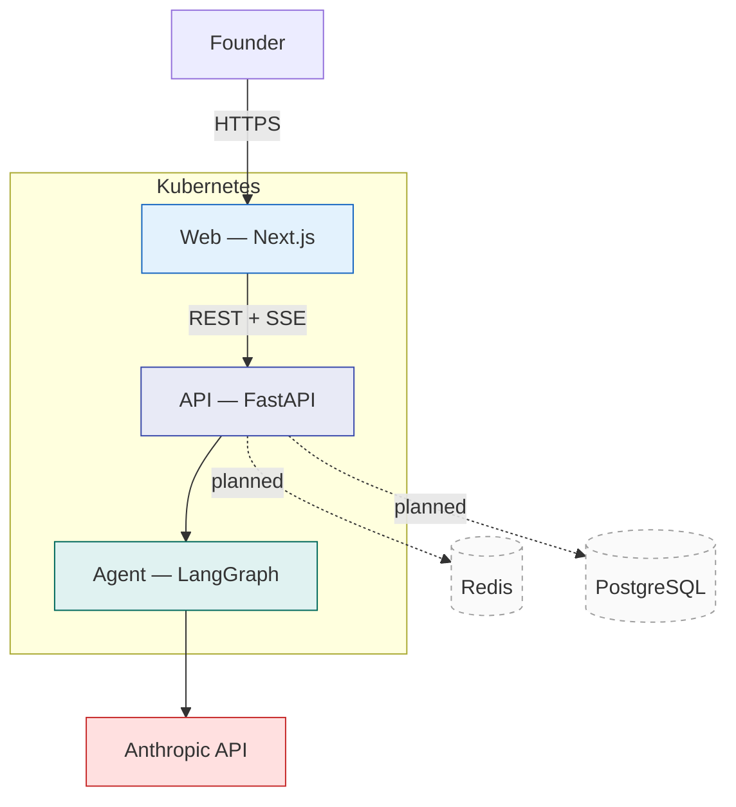
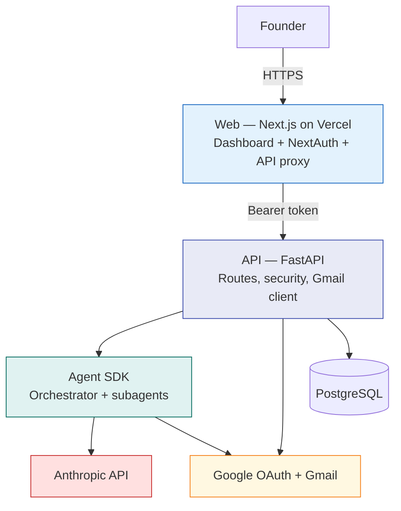
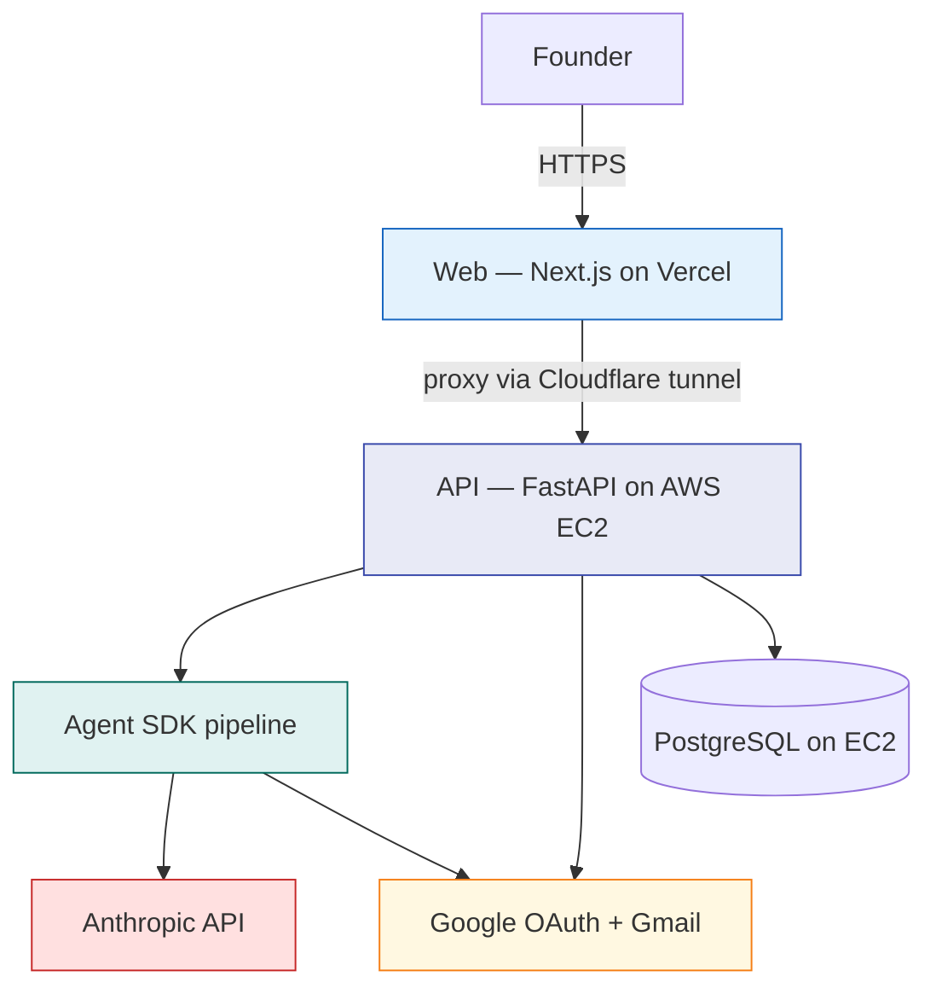
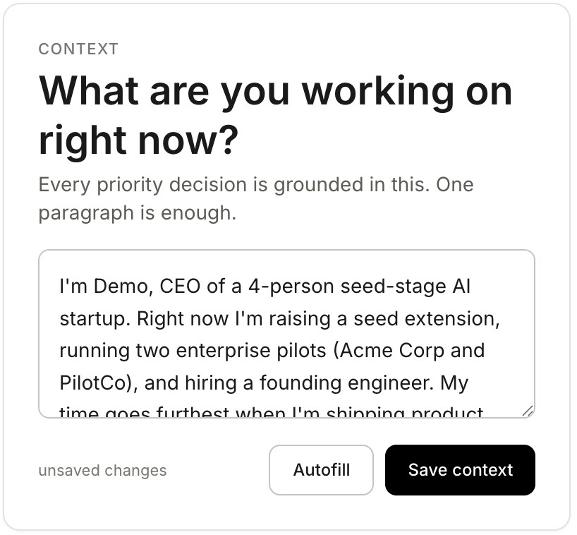
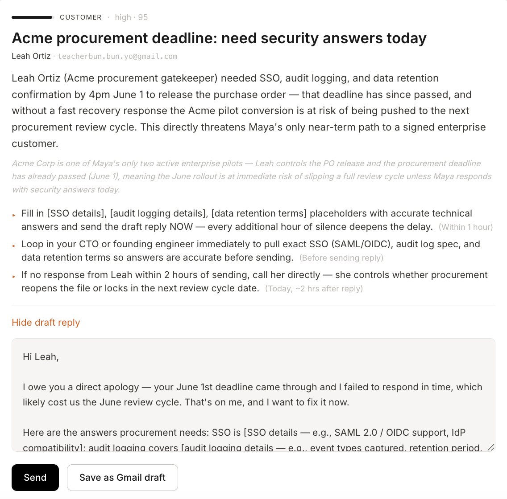
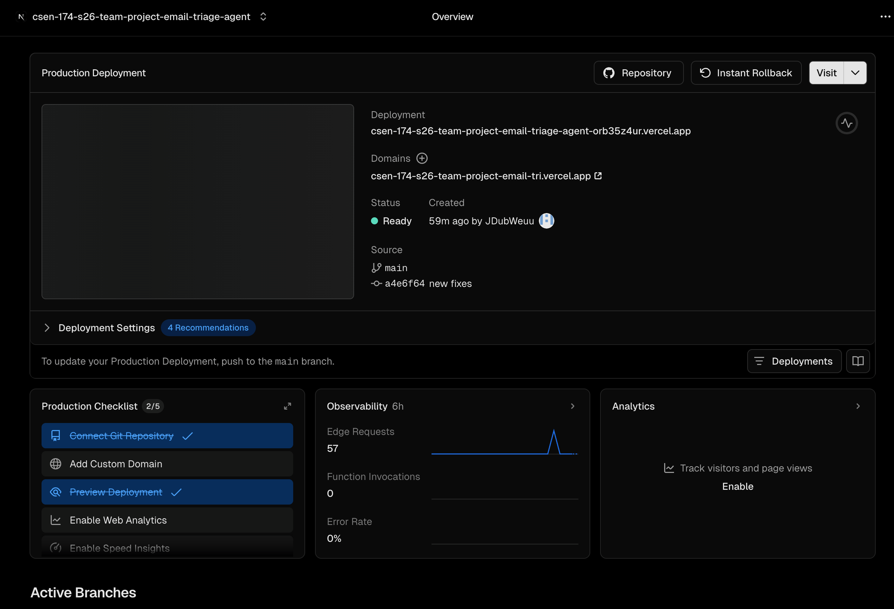

<!--
PDF export: 4–6 pages · 11-pt body minimum · 1-inch margins.
Identifier block is part of page 1, not a separate title page.
-->

<h1> Technical Report for Email Triage Agent (Spring 2026) </h1>
<h3> Jason Wu, Ethan Diec </h3>

## 1. Product Vision Evolution

In Week 2 we set out to build a SaaS inbox assistant for entrepreneurs who need to balance product work with email that actually moves their company forward, and who are tired of generic AI summaries that describe what an email is about without saying what to do. That original vision can be found in [docs/product/product-vision.md](../product/product-vision.md).

Our problem framing also named early-stage technical founders as the core users: people strong at building but still learning how to run investor, customer, and partner threads, documented in [docs/discovery/problem-framing-canvas.md](../discovery/problem-framing-canvas.md).

We still have that core vision, but something that changed is how narrowly we define our use case. We moved from a broad personalized email management system to a daily action digest for founders.

| | **W2 Vision** | **Final Vision** |
|---|---|---|
| Who | Entrepreneurs broadly | Founder-led sellers (same person, narrower job) |
| Problem | Inbox overload; tools ignore founder context | Same — added focus on buried revenue threads and summaries that lack action items |
| Promise | Organize, prioritize, surface actionable insights | Three-bucket digest grounded in this week's context |
| Differentiator | Adapts to workflows vs. Gemini | Every card answers why this matters to my pipeline now |

Mid-quarter feedback from Professor Lukoff was the main trigger for that change. He pushed us to stop trying to serve every founder workflow equally and to optimize for sales: prospects, active deals, customer follow-ups, and partnerships. We kept the Week 2 stance against generic Gemini-style summaries but dropped vague workflow automation language in favor of concrete outputs: priority, a one-line reason, next steps, and a draft reply when the email is worth answering.

Our Week 3 storyboards gave us the product shape. Both [storyboard_jason.md](../discovery/storyboard_jason.md) and [storyboard_ethan.md](../discovery/storyboard_ethan.md) end in the same way. They each have a UI providing a "who are you" context question that leads into three cards labeled Act Today, Decide This Week, and FYI, instead of a UI that requires users to scroll through hundreds of unread messages. We also expanded the vision to include editable draft replies the founder can send after review.

We cut the idea of a multi-surface dashboard with separate inbox, profile, and settings areas in favor of one triage board. We deferred a dedicated profile tab ([#6](https://github.com/CSEN-SCU/csen-174-s26-team-project-email-triage-agent/issues/6)) from the sprint board, given the context blurb on the main screen carries founder context in a more direct way.

Looking at our original storyboards, Maya Chen in [storyboard_jason.md](../discovery/storyboard_jason.md) is still our primary persona. She is a seed-stage technical CEO whose Bessemer thread sits buried for eleven days because nothing ranked it against her fundraise. After Professor Lukoff's feedback, the product serves Maya more directly. John in [storyboard_ethan.md](../discovery/storyboard_ethan.md), the student founder juggling campus mail and a nonprofit pilot, remains in scope through the context blurb. He can tell the agent what matters this month and get startup stakes surfaced above school noise, but we did not build a separate student-founder mode.

If we had to name one user our app best supports today, it is Maya. John is supported when he writes good context, not through a second persona-specific experience.

---

## 2. Architecture Evolution

Our architecture evolved through three stages: the Week 4 plan, the Week 8 revised architecture, and code freeze at demo night ([architecture-final.md](../architecture/architecture-final.md)).

| | **W4 (planned)** | **W8 (revised)** | **Code freeze** |
|---|---|---|---|
| Diagram | [architecture.md](../architecture/architecture.md) | [architecture-retrospective.md](../architecture/architecture-retrospective.md) Part 3 | [architecture-final.md](../architecture/architecture-final.md) |
| Frontend | Next.js on Kubernetes | Next.js on Vercel | Same — Vercel |
| Backend | FastAPI on Kubernetes | FastAPI + Claude Agent SDK orchestrator | Same code path; hosted on AWS EC2 |
| Agent | LangGraph in graph.py | SDK orchestrator + subagents + MCP tools | Same as W8 ([PR #23](https://github.com/CSEN-SCU/csen-174-s26-team-project-email-triage-agent/pull/23)) |
| Data | Postgres/SQLite + Redis | Postgres + profile cache | Same; mock fallback kept for demos |
| Gmail | Planned | OAuth, read, compose via NextAuth + proxy | Same pattern |
| Infra | Kubernetes + Redis | Vercel + standalone backend | AWS EC2 + Docker + Cloudflare tunnel |

During week 4, we planned one consolidated app on Kubernetes: Next.js frontend, FastAPI backend, in-process LangGraph, Postgres or SQLite, Redis cache, and the Anthropic API. Gmail was marked as planned integration. Full diagram in [architecture.md](../architecture/architecture.md).

*Figure 1 — W4 container model (simplified).*

In Week 8, we revised that plan in [architecture-retrospective.md](../architecture/architecture-retrospective.md). We dropped Kubernetes and Redis, put the frontend on Vercel, and split the backend into a FastAPI API layer plus a Claude Agent SDK pipeline with subagents and Gmail tools — implemented in [PR #23](https://github.com/CSEN-SCU/csen-174-s26-team-project-email-triage-agent/pull/23).

*Figure 2 — W8 container model (simplified). Same logical architecture submitted in the retrospective.*

At code freeze, our container diagram shares the same logic as that of W8. What we added was where the API and database run: AWS EC2 behind a Cloudflare tunnel, with the frontend still on Vercel ([deploy.sh](../../infra/scripts/deploy.sh)). The full detailed diagram is in [architecture-final.md](../architecture/architecture-final.md).

*Figure 3 — Code freeze container model (simplified). See [architecture-final.md](../architecture/architecture-final.md) for the detailed version.*

| Transition | What changed | Repo anchor |
|---|---|---|
| W4 → W8 | Drop K8s/Redis; Vercel + SDK pipeline; real Gmail | [architecture-retrospective.md](../architecture/architecture-retrospective.md), [PR #23](https://github.com/CSEN-SCU/csen-174-s26-team-project-email-triage-agent/pull/23) |
| W8 → freeze | API + Postgres moved to AWS EC2; Cloudflare tunnel | [deploy.sh](../../infra/scripts/deploy.sh) |

---

## 3. Current State of the Product

Live app: https://csen-174-s26-team-project-email-tri.vercel.app
 Demo video: https://youtu.be/7VFHkREKf4k
  Code freeze: [demo-night](https://github.com/CSEN-SCU/csen-174-s26-team-project-email-triage-agent/commit/a681e69965080ca41f8fcee6eea1c436213eda66)

The typical flow of the app includes opening the /app path, typing context in [ContextCard.tsx](../../consolidated_project/frontend/components/ContextCard.tsx), connecting Gmail, and running triage. [/api/triage/stream](../../consolidated_project/backend/app/api/routes.py) pushes one TriageResult per email over SSE into three columns on [page.tsx](../../consolidated_project/frontend/app/(app)/app/page.tsx). Each [TriageCard.tsx](../../consolidated_project/frontend/components/TriageCard.tsx) shows intent, priority, summary, actions, and sometimes an editable draft.

*Figure 4 — User context blurb before triage.*

*Figure 5 — Draft reply with Send and Save as draft.*

Major Features Shipped at Code Freeze:

- Sales-focused, context-grounded triage — [4766812](https://github.com/CSEN-SCU/csen-174-s26-team-project-email-triage-agent/commit/4766812)
- SSE stream: one TriageResult card per email — [2308d94](https://github.com/CSEN-SCU/csen-174-s26-team-project-email-triage-agent/commit/2308d94)
- Three-bucket kanban with collapsible columns — [bed9eeb](https://github.com/CSEN-SCU/csen-174-s26-team-project-email-triage-agent/commit/bed9eeb)
- Gmail OAuth and live inbox fetch — [627a33f](https://github.com/CSEN-SCU/csen-174-s26-team-project-email-triage-agent/commit/627a33f)
- Editable draft reply with Send and Save as draft — [0b45465](https://github.com/CSEN-SCU/csen-174-s26-team-project-email-triage-agent/commit/0b45465)
- Voice and relationship profile cache — [611a898](https://github.com/CSEN-SCU/csen-174-s26-team-project-email-triage-agent/commit/611a898)
- Gmail history, enrichment subagent, and drafter subagent for per-contact voice — [3d13bd2](https://github.com/CSEN-SCU/csen-174-s26-team-project-email-triage-agent/commit/3d13bd2)
- Triage result cache between runs — [246104f](https://github.com/CSEN-SCU/csen-174-s26-team-project-email-triage-agent/commit/246104f)

The product does not yet support per-email draft regeneration ([#8](https://github.com/CSEN-SCU/csen-174-s26-team-project-email-triage-agent/issues/8)), a dedicated profile tab ([#6](https://github.com/CSEN-SCU/csen-174-s26-team-project-email-triage-agent/issues/6)), single-email summary and action retrieval, or strict output validation on every model field.

Rough edges we know about are the inability to send and draft without a live Google token in the frontend proxy, and the inability to handle Gmail errors by falling back to the mock inbox. Triage also requires the Claude Code CLI on the server — see [backend/README.md](../../consolidated_project/backend/README.md).

---

## 4. Engineering Process: Testing, Security, Deployment

### Testing

Our Week 5 plan called for Vitest on frontend API helpers and backend unittest for inbox DB and live Claude triage shape, described in [sprint-1-testing.md](../sprints/sprint-1-testing.md).

We implemented npm test from consolidated_project, which runs Vitest plus backend discovery. We chose behavior-level frontend tests over component snapshots. One example is the isValidBucket test in [triage-helpers.test.ts](../../consolidated_project/frontend/test/triage-helpers.test.ts): it locks the three API bucket slugs to the UI so a typo in lib/types.ts cannot silently add a fourth column.

We do not run live Anthropic calls in CI. [backend-ci.yml](../../.github/workflows/backend-ci.yml) uses a dummy key instead. Postgres integration runs in backend CI with a service container.

Cursor drafted api.test.ts and triage-helpers.test.ts. We kept tests that describe user-visible behavior and dropped ones that only mirrored implementation. Streaming was a gap: Jason still stepped through LangGraph SSE bugs manually when tests did not cover it, noted in [sprint-1-retro.md](../sprints/sprint-1-retro.md).

### Security

Week 7 was a peer red-team review of auth, prompt injection, and data exposure.

We shipped three fixes in one sprint. Prompt and SQL sanitization landed in [0a87c85](https://github.com/CSEN-SCU/csen-174-s26-team-project-email-triage-agent/commit/0a87c85) under [app/security/](../../consolidated_project/backend/app/security/). NextAuth Google OAuth and a landing/app split shipped in [627a33f](https://github.com/CSEN-SCU/csen-174-s26-team-project-email-triage-agent/commit/627a33f). A production gateway key lives in [gateway.py](../../consolidated_project/backend/app/security/gateway.py).

We deferred email body caps, blocklists, and automatic post-triage deletion, as recorded in [sprint-2-retro.md](../sprints/sprint-2-retro.md).

Models suggested stub OAuth callbacks. We verified redirect URIs and scopes in Google Cloud by hand.

### Deployment

Week 6 planned GitHub Actions CI and Vercel for the frontend, in [sprint-1-cicd.md](../sprints/sprint-1-cicd.md) and [PR #11](https://github.com/CSEN-SCU/csen-174-s26-team-project-email-triage-agent/pull/11).

[ci.yml](../../.github/workflows/ci.yml) runs npm ci and next build on every PR to main. [backend-ci.yml](../../.github/workflows/backend-ci.yml) runs backend tests and Docker image builds when backend paths change.

[cd.yml](../../.github/workflows/cd.yml) plus [deploy.sh](../../infra/scripts/deploy.sh) push the backend image to ECR and deploy on EC2 via SSM.

*Figure 6 — Frontend deployment on Vercel.*

---

## 5. Successes, Setbacks, and What Would Change

### Successes

Sales-focused prompts after Professor Lukoff's feedback were the biggest demo successes. [4766812](https://github.com/CSEN-SCU/csen-174-s26-team-project-email-triage-agent/commit/4766812) stopped cards from saying “this email is about a meeting” and started saying why it matters to your pipeline. We would keep the one-paragraph user context in every prompt.

Historical email context was the other big one. Before [PR #23](https://github.com/CSEN-SCU/csen-174-s26-team-project-email-triage-agent/pull/23), every draft sounded like the same generic seller.

Now the enrichment subagent pulls two things from Gmail: a global voice profile from your sent mail (how you greet people, how formal you are, how long you write) and a per-contact overlay from threads with that sender. The drafter calls gmail_past_replies and copies your actual greeting, sign-off, and tone for that person — not one template for everyone.

So you can sound sharp with a prospect and looser with someone you email like family or a close coworker. Dates, prices, and names from old threads come back through gmail_lookup_history instead of [placeholder] text.

Under the hood it is two subagents. [orchestrator.py](../../consolidated_project/backend/app/agent/orchestrator.py) runs context-enrichment first, then drafter ([subagents.py](../../consolidated_project/backend/app/agent/subagents.py)), each with its own model, prompt, and tools. Enrichment hits [tools.py](../../consolidated_project/backend/app/agent/tools.py) — gmail_sample_sent, gmail_sender_history, profile cache — and spits out a short VOICE / RELATIONSHIP / OVERLAY block. Drafter only gets gmail_past_replies and gmail_lookup_history.

Profiles sit in Postgres ([profile_repository.py](../../consolidated_project/backend/app/profile_repository.py)) so we are not re-fetching sent mail every triage. FastAPI routes and SSE did not change; we just split the agent graph. That split is worth keeping: one agent learns the relationship, one writes the reply.

Red-team fixes landed in one sprint too — all three Week 7 findings got commits, and OAuth gates stopped signed-in users from accidentally seeing the mock inbox.

### Setbacks

Three parallel prototype trees (Ethan / Jason / consolidated) burned time early. Cursor kept patching the wrong folder until we pasted full paths every time ([sprint-1-retro.md](../sprints/sprint-1-retro.md)). We should have merged into one tree by Week 5, not Week 8.

We also built Gmail UI before the backend could support it. [architecture-retrospective.md](../architecture/architecture-retrospective.md) Part 5 calls that out. Next time: wire the proxy and /api/emails contract first, polish the dashboard second.

Sprint 3 we planned Antigravity containers ([sprint-2-retro.md](../sprints/sprint-2-retro.md)), then bailed to in-process Claude Agent SDK when orchestration was too much for one sprint.

### AI Tools

Cursor was best for cross-stack glue — paste the SSE shape from routes.py, get matching types in lib/types.ts, fix Vitest mocks without hopping repos.

We had to override it on OAuth redirect URLs, which prototype folder to edit, and runtime debugging for LangGraph then Agent SDK.

Claude Code supported the backend agent migration in [PR #23](https://github.com/CSEN-SCU/csen-174-s26-team-project-email-triage-agent/pull/23). [7df04e9](https://github.com/CSEN-SCU/csen-174-s26-team-project-email-triage-agent/commit/7df04e9) swapped LangGraph for claude-agent-sdk and documented that triage spawns the Claude Code CLI as a subprocess. Follow-on commits through [3d13bd2](https://github.com/CSEN-SCU/csen-174-s26-team-project-email-triage-agent/commit/3d13bd2) landed the orchestrator, subagent definitions, Gmail MCP tools, and SSE wiring.

That choice paid off for multi-step agent work: subagent prompts, tool schemas, and orchestrator flow were easier to iterate in Claude Code than in a single Cursor thread. The tradeoff is operational — production EC2 must have the CLI installed, same as local dev in [backend/README.md](../../consolidated_project/backend/README.md).

---

## 6. Future Work

| Priority | Item | Effort | Type |
|---|---|---|---|
| 1 | Draft regeneration without full re-triage ([#8](https://github.com/CSEN-SCU/csen-174-s26-team-project-email-triage-agent/issues/8)) | Afternoon–sprint | Next sprint |
| 2 | Profile / context tab ([#6](https://github.com/CSEN-SCU/csen-174-s26-team-project-email-triage-agent/issues/6)) | Sprint | Next sprint |
| 3 | SDK error logging + concurrency caps | Week | Next sprint |
| 4 | Post-triage deletion + output validation | Sprint | Next sprint |
| 5 | Async Gmail client | Week+ | Research / refactor |

1–4 are next-sprint work if we had another week. 5 is a bigger Gmail perf refactor.

---

## 7. Advice to Future CSEN 174 Teams

1. Consolidate to one app tree before Week 6 — we lost days when AI tools edited the wrong prototype folder.
2. Wire OAuth and the API proxy before UI polish — our Gmail path worked, but the sequencing cost rework documented in the [architecture retrospective](../architecture/architecture-retrospective.md).
3. Pick one agent architecture by mid-quarter and ship it (we shifted plans between Kubernetes, Antigravity, LangGraph, and the Claude Agent SDK) the product really started making progress once we stopped replanning and hardened one path.
