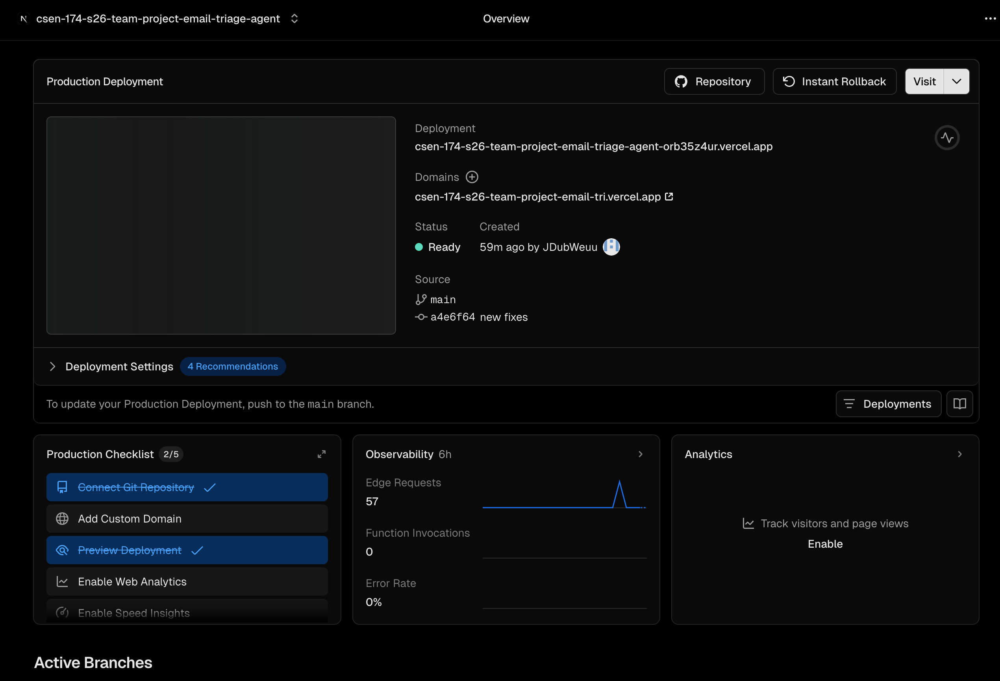

# Merged PR Link

https://github.com/CSEN-SCU/csen-174-s26-team-project-email-triage-agent/pull/11

# CI Workflow Reflection

We do not store or inject secrets through GitHub Actions: our `.github/workflows/ci.yml` never uses `secrets.*`, so keys like **`ANTHROPIC_API_KEY`** never flow through CI. We only configure those (and optional **`DATABASE_URL`**, model names, and **`CORS_ORIGINS`**, per `consolidated_project/backend/.env.example`) in **local `.env` or the environment where the backend runs**, where the process reads them at runtime. Our frontend CI build does not need a real API URL because `next.config.ts` falls back to `http://localhost:8000` for `NEXT_PUBLIC_API_BASE` when that variable is unset. For the deployed frontend, we put **`NEXT_PUBLIC_API_BASE`** (and any other non-secret public env the build needs) in **Vercel’s project environment settings**, not in the repo or Actions. We do not use a GitHub Actions CD workflow, so nothing deploy-time is loaded from `secrets.*` either.

# Live Deployment Link

https://csen-174-s26-team-project-email-tri.vercel.app/

# Deployment Dashboard

# Live Deployment Reflection

We chose **Vercel** for the consolidated Next.js frontend because it matches our stack out of the box (first-class **Next.js** hosting, preview URLs, and environment-based config without us running our own Node servers). That let us ship the `consolidated_project/frontend` app quickly while the FastAPI backend stays separate. The first deploy that failed was mostly around **dependencies**: our `package.json` uses a **React 19 RC** with Next 15, so a strict `npm ci` on Vercel hit **peer dependency** conflicts until we set the install command to **`npm ci --legacy-peer-deps`** in `vercel.json`. We also had to remember to set **`NEXT_PUBLIC_API_BASE`** in the Vercel project to our real API origin so production rewrites did not keep pointing at localhost.
