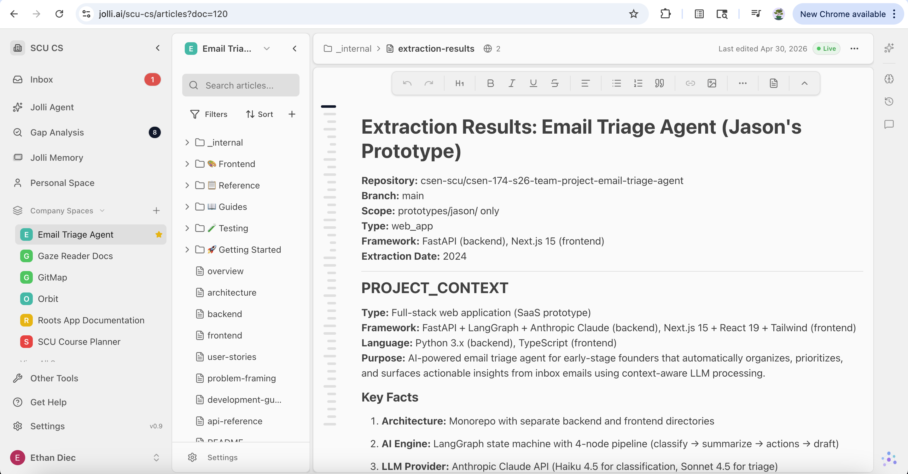

# Part 1

## Run all tests

1. **Frontend:** `cd consolidated_project/frontend && npm install`
2. **Backend:** `cd consolidated_project/backend && python3 -m venv .venv && source .venv/bin/activate && pip install -r requirements.txt`  
3. **Test:** `cd consolidated_project && npm test`

**Optional:**

- Copy **`consolidated_project/backend/.env.example`** to **`.env`** and add secrets
- **Postgres:** `docker compose up -d` in `consolidated_project/backend/` and set **`DATABASE_URL`** in `.env` so DB integration tests can connect.
- **AI Test:** set **`ANTHROPIC_API_KEY`** or **`CLAUDE_API_KEY`**.

## Unit Tests (frontend)

**Ethan** — `getContext returns some context that isn't empty`

- **File:** `consolidated_project/frontend/test/api.test.ts`
- **Purpose:** Confirms the API client's `getContext()` returns a non-empty string.

**Jason** — `listEmails returns all emails needed`

- **File:** `consolidated_project/frontend/test/api.test.ts`
- **Purpose:** Confirms `listEmails()` returns an array whose first item has string `id`, `subject`, and `thread_id`.

## Integration Tests (backend)

**Tests:** `test_get_email_matches_db_row`, `test_inserted_row_is_returned_by_api`

- **File:** `consolidated_project/backend/tests/test_email_db_integration.py`
- **Purpose:** The email REST API matches Postgres: seeded `e1` matches a direct row read, and a synthetic DB-only row is returned by `GET /api/emails/{id}` then deleted afterward.
- **Setup:** Requires `DATABASE_URL` (or `TEST_DATABASE_URL`) and Postgres (e.g. Docker).

## AI Behavior Test (backend)

**Test:** `test_triage_endpoint_calls_claude_and_returns_digest`

- **File:** `consolidated_project/backend/tests/test_triage_endpoint_integration.py`
- **Purpose:** Live `POST /api/triage` through LangGraph + Anthropic; checks response shape, per-email digests, signals, summaries, and actions.
- **Setup:** Skipped unless `ANTHROPIC_API_KEY` or `CLAUDE_API_KEY` is set.

# Part 2

We added the Vitest cases in `frontend/test/api.test.ts` and ran `npm test` while `lib/api.ts` was still incomplete, then fixed the client until both passed.

## Test: `getContext returns some context that isn't empty`

- **RED:** Early `api.getContext()` returned the whole JSON object, so the test never received a plain non-empty string.
- **GREEN:** Implemented parsing so the method returns only `data.user_context` from the `/api/context` response body.

## Test: `listEmails returns all emails needed`

- **RED:** We  parsed the response wrong (the method did not return a real `Email[]` from `json(await fetch("/api/emails", …))`), so `emails[0]` was missing or lacked `id`, `subject`, and `thread_id`.
- **GREEN:** Implemented `listEmails` to return the parsed array directly, matching the API contract the test expects.

**Later sprints:** Postgres integration tests and the live Claude triage test will be turned green later on.

# Part 3

Our group picked Matt Pocock’s TDD skill (the one in `.cursor/skills/tdd`) mostly because it lines up with what we’re actually using in consolidated_project: the frontend is Next.js with Vitest and MSW, and the backend is Python with FastAPI and `unittest`. We have some quick tests and then heavier stuff like Postgres and the real Claude call, so we wanted advice that still made sense for that mix.

What helped us the most was the idea that tests should describe behavior people care about (what the app does from the outside) instead of locking us to how the code is structured inside. The skill also pushes small steps: write one failing test, write the smallest change to pass it, then repeat. That felt better than writing a huge batch of tests first and then trying to implement everything at once, which we tried once and it got messy fast.

After we loaded it in Cursor, we started naming tests a bit more like our product language (inbox, triage, buckets). For anything that hits the network we still lean on integration-style checks when we can. We don’t always have API keys or Docker Postgres running, so some tests stay skipped on our laptops, and that’s fine for now.

# Part 4 — Reviewing two AI-generated unit tests

For this part we looked at two tests Cursor helped us write in `consolidated_project/frontend/test/triage-helpers.test.ts` (same file as the small helper tests from earlier in the sprint). Below: does each test describe something a user actually needs, would it break if we refactored without changing behavior, and what cases did we forget?

## 1. `isValidBucket`

**User need vs what the code does:** Checks the obvious thing of three strings pass and random junk fails. It doesn’t really say why that matters for a founder (for us: we don’t want the UI treating a typo or random string like a real column and showing the wrong bucket).

**Refactor:** We think it would still pass if we rewrote the helper (e.g. use a `Set` instead of an array) as long as the answers stay the same. So it’s not super fragile.

**What we missed at first:** We didn’t test weird but realistic string problems—like all caps `FYI` or a leading space before `act_today`. Stuff that shouldn’t come from a perfect API but could show up from copy-paste or debugging.

## 2. `clampTriagePriority`

**User need vs what the code does:** This one is a bit closer to the product: if the model sends an irrelevant priority, the number you show in the UI shouldn’t go off the rails. The test still just checks raw numbers though, not a real label on a component.

**Refactor:** If we changed the implementation but still clamped the same way, the test should keep passing. Good enough for a small helper.

**What we didn’t cover:** Edge cases like `NaN`, decimals, or `Infinity`. We’d have to decide what we even want those to mean before writing tests, so we left that for later.

## Improved test (before / after)

We updated `isValidBucket` first because it was the easiest win: clearer test name + two extra expects for case and whitespace. Here’s the diff.

```diff
 describe("isValidBucket", () => {
-    test("returns true for act_today, decide_this_week, and fyi only", () => {
+    test("only exact API bucket slugs count as valid triage columns", () => {
         expect(isValidBucket("act_today")).toBe(true)
         expect(isValidBucket("decide_this_week")).toBe(true)
         expect(isValidBucket("fyi")).toBe(true)
         expect(isValidBucket("spam")).toBe(false)
         expect(isValidBucket("")).toBe(false)
+        expect(isValidBucket("FYI")).toBe(false)
+        expect(isValidBucket(" act_today")).toBe(false)
     })
 })
```

# Part 5
